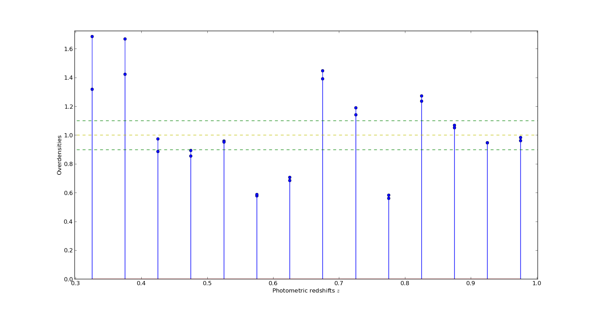

This is the central plot for all the analysis that follows. The plot below shows the overdensities in different redshift bins. The overdensities are computed by fitting a ChiSquare and a Gamma curve to the redshift distribution of a volume-limited sample separately and $\delta := N/N_{mod}$.

  

Plot (a) shows the number of galaxies in each bin along with a scaled version of comoving volume. Plot (b) shows the comoving number density. Points with z > 0.85 are not very reliable.

    
    

Note that the plot of comoving densities is very similar to the plot of overdensities. This is because the fits were very much like the comoving-volume in shape ( This is loose talk. Add more plots to support this. )

